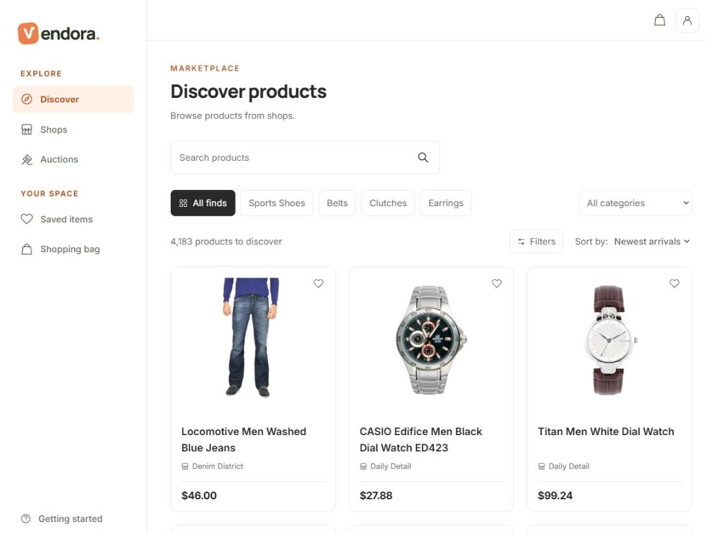
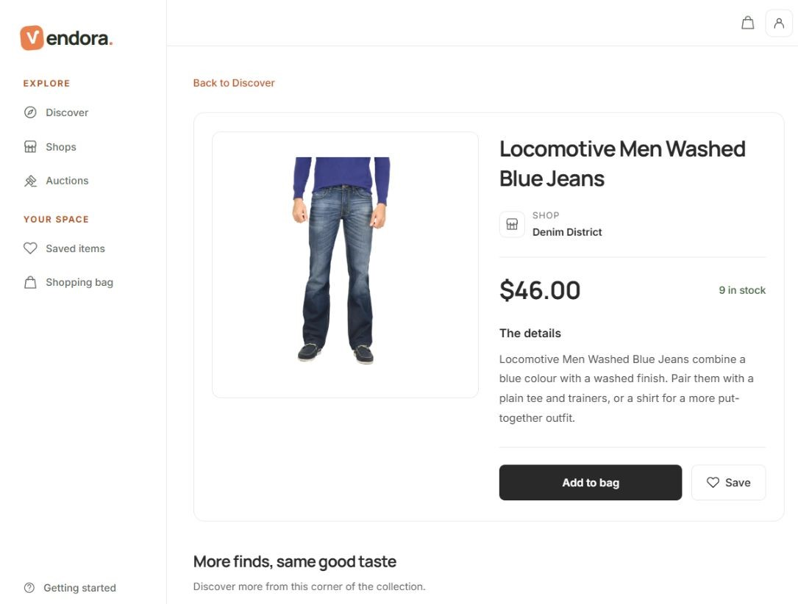
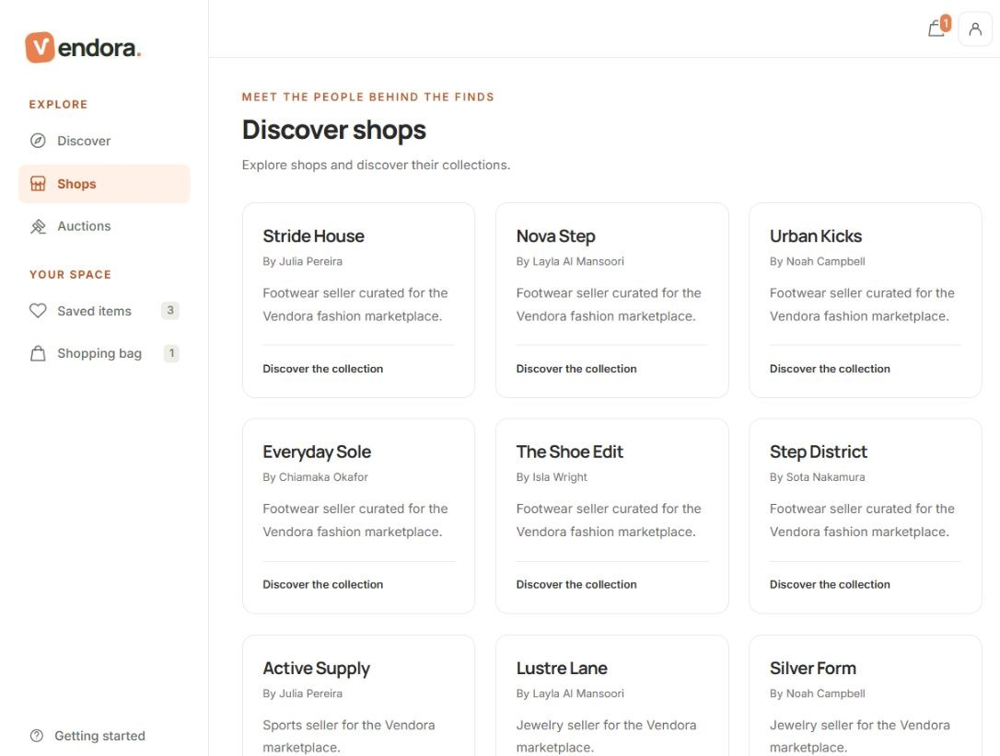
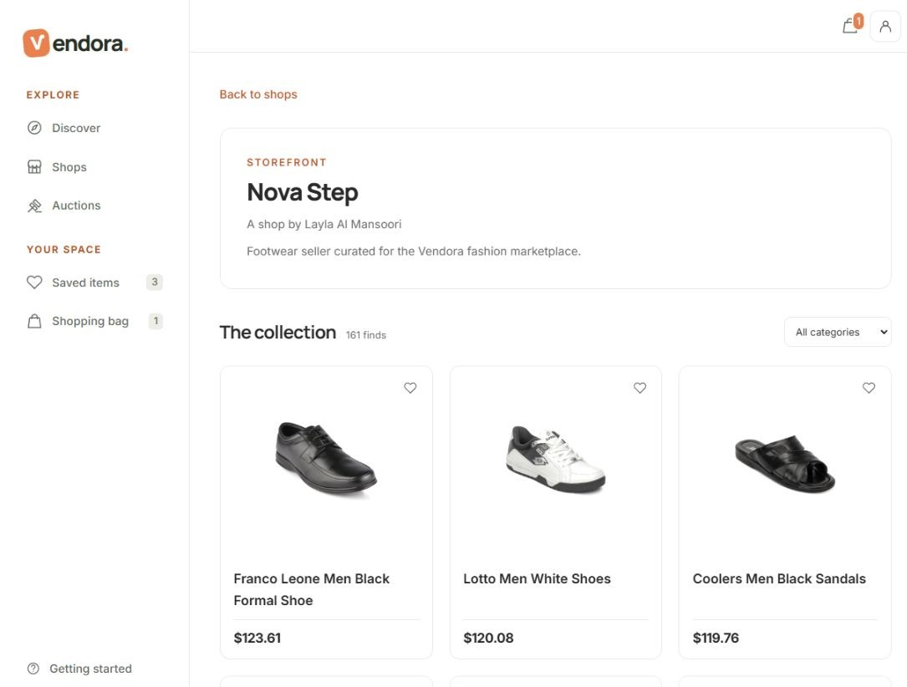
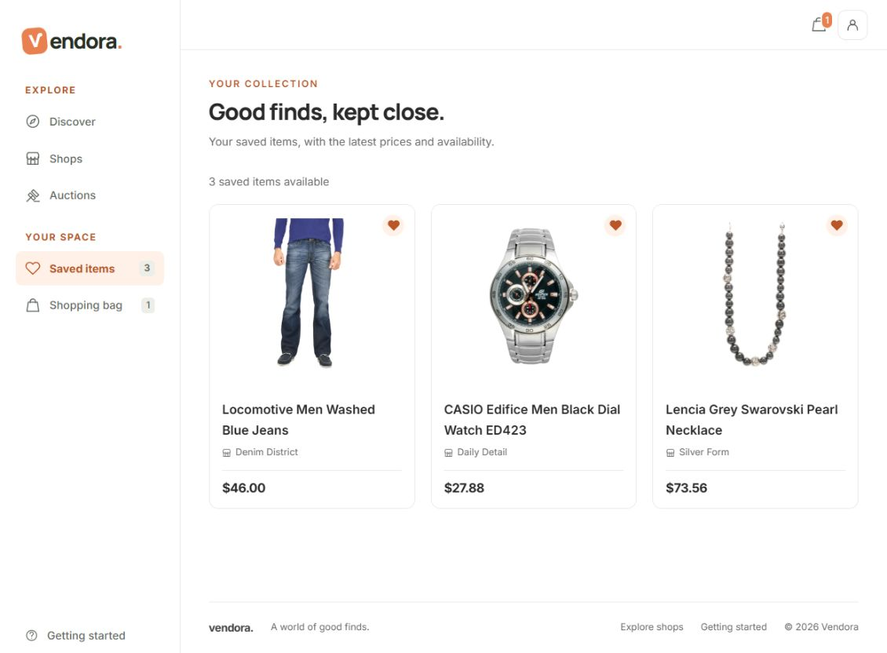
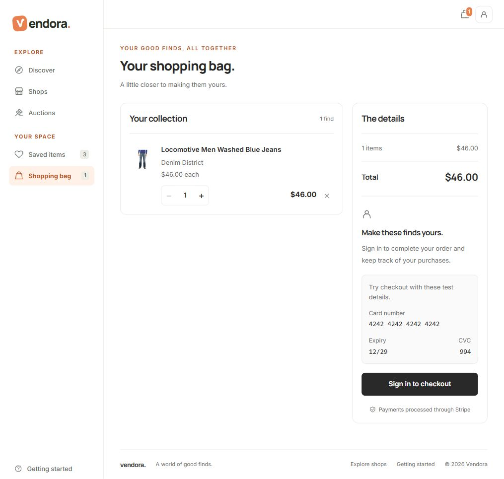
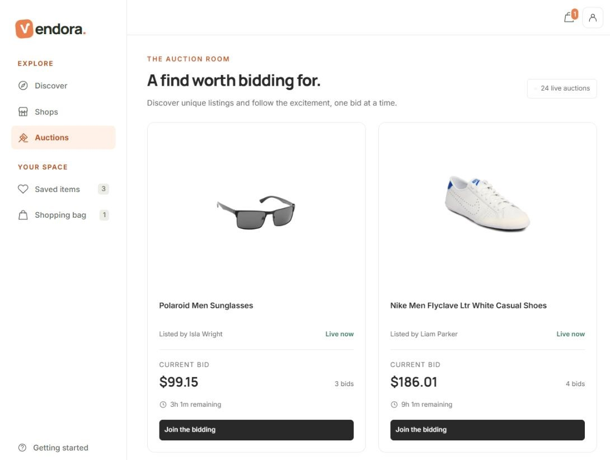
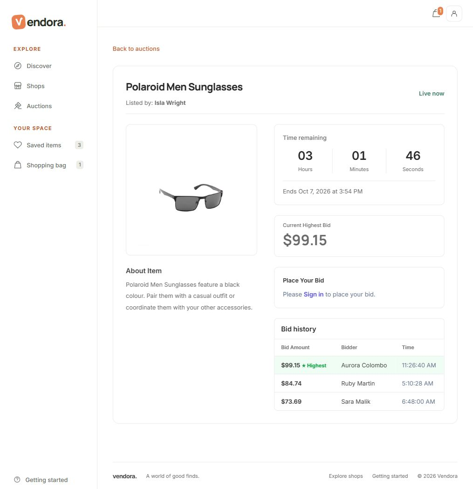

# Vendora

Vendora brings shopping and live auctions together in one marketplace. Browse products from different shops, save the items you like, and choose how to make your next purchase. For sellers, Vendora provides a storefront and the tools to manage listings, auctions, and customer orders.

## Find something that fits

Search for a product, explore a category, or browse a shop's collection. Narrow your results by price and availability, and sort them to suit the way you shop. More products appear as you scroll, so you can keep exploring without moving between pages.

Each product page brings its image, description, price, stock availability, and shop together. Related products give you more options to consider.

## Explore the shops

Meet the shops behind the listings, then open a storefront to browse its collection. Choose a category within the shop to find the products that interest you.

## Keep your favorites close

Save an item with the heart button and return to it in your saved collection. Prices and availability refresh when you open the collection, helping you decide what to buy next.

Your saved items and shopping bag stay on the device you're using.

## From shopping bag to order

Add products to your bag, adjust quantities, and review your total before checkout. Sign in, enter your delivery details, and pay by card to place your order.

Vendora checks current prices and stock when you order. After checkout, you can open your receipt and revisit your purchases in **My orders**, including the fulfillment status of each item.

## Follow the auction

Explore live and upcoming auctions, see the current bid, and follow the countdown. Open an auction to read about the item and view its bid history.

Sign in to place a bid while the auction is open. Bid activity updates as it happens, so you can follow the competition from the auction page. Your account keeps the auctions you've participated in together under **My bids**.

## License

This project is licensed under the [MIT](LICENSE) License.
